# Algorithm_03

**Results**
|         | Accuracy |
|:-------:|:--------:|
| Model 1 |   97.28  |
| Model 2 |   98.60  |
| Model 3 |   98.66  |  

## Model 1
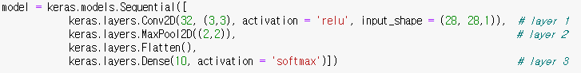

### Train with Adam optimizer and training loss
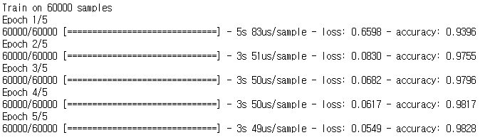

### Test Accuracy
(train image of model 3)  
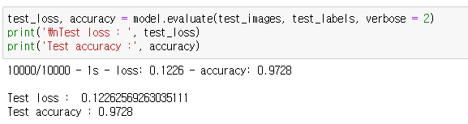

### Success images and corresponding probability

### Failure images and corresponding probability
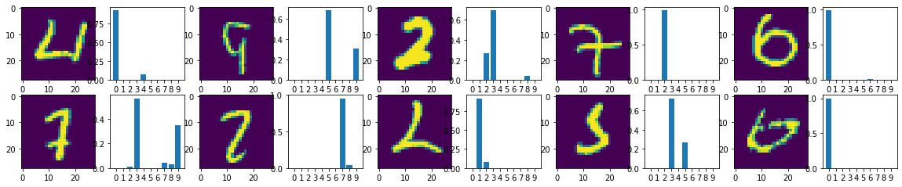

## Model 2
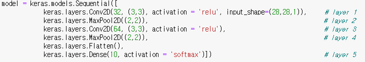

### Train with Adam optimizer and training loss
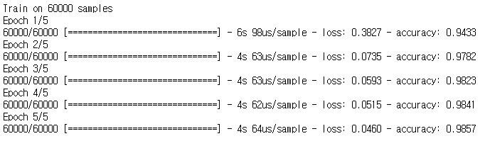

### Test Accuracy
(train image of model 3)  
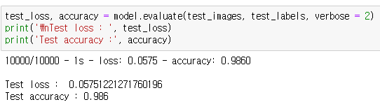

### Success images and corresponding probability
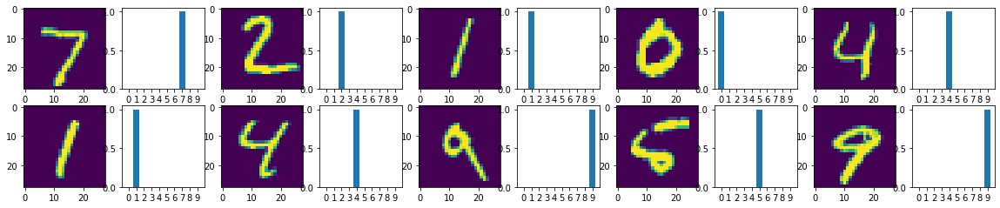

### Failure images and corresponding probability
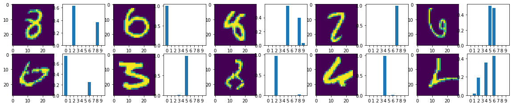

## Model 3
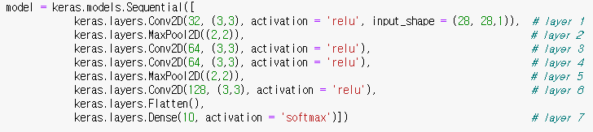

### Train with Adam optimizer and training loss
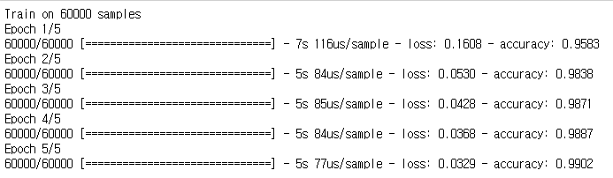

### Test Accuracy
(train image of model 3)  
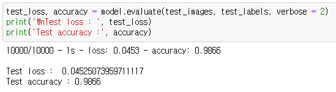

### Success images and corresponding probability

### Failure images and corresponding probability
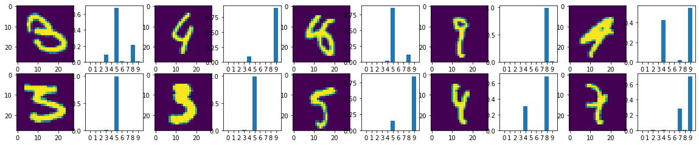
